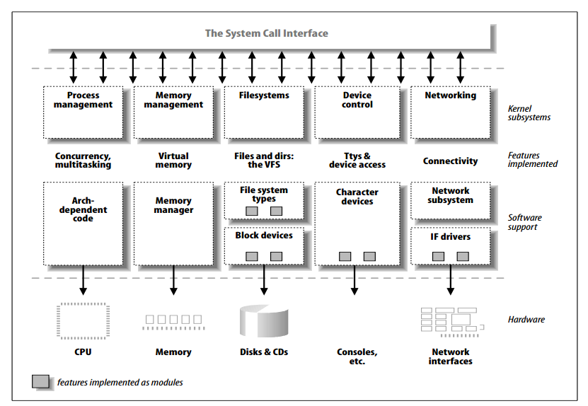

## Classes of Devices Overview

Each of the `different classes of devices` like Mouse, Pen-Drive, Hard Disk, ethernet card etc has `diffrent set of properties` and functions. 

For example Hard Disk devices require large chunks of data/files to be accessed, read or writte, whereas devices like Mouse require really small chunks of data to be accessed. Yet, the devices like ethernet require streaming data 'say Video data over TCP' to be processed. 

So to cater to `different classes of devices` we need `diffrent type of drivers/modules`

## Classifiable of Device in Linux Kernel

Each Device is classified into - 
- Character devices
- Block devices
- Network Devices/interfaces

### Character devices

- Accessed as a stream of bytes
- Implementing by `char driver`
- Usually Implements the `open`, `close`, `read`, and `write` system calls.
- Examples: Serial Console Devices: `/dev/console` and `/dev/ttyS0`

> "System calls" is a programmatic way in which a computer program requests a service from the kernel of the operating system. It provides an interface between a process and operating system to allow user-level processes to request services of the operating system.

### Block devices

- Block devices are accessed by filesystem nodes
- Block devices live in `/dev` directory
- Block Devices handle I/O operations that transfer one or more whole blocks, which are usually 512 bytes

### Network interfaces

- 

