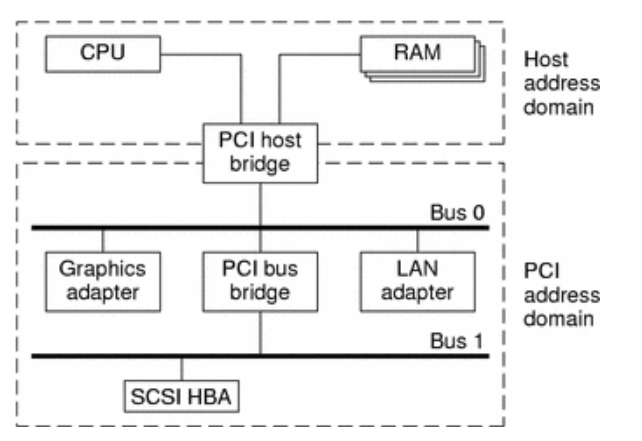

## Peripheral Component Interconnect (PCI)

Peripheral Component Interconnect (PCI) is an `interconnection system` between a processor and attached PCI devices.

- Part of PCI Specification Standard
- Replacement for the ISA standard
- Better performance when transferring data
- As platform independent as possible
- Simplify adding and removing peripherals
- Autodetection of interface boards
- Higher Clocking rates - 33 MHz, 66Mhz and 133-MHz
- 32-bit and 64-bit data bus support
- All Major platforms implement PCI: ARM, PowerPC, Mips etc

### PCI Interconnect Block Diagram



### PCI Local Bus

- The `PCI local bus` is a high-performance bus designed for high-speed data transfer
- It interconnects Peripheral Devices with host processor and main memory
- Provides mapping and access between "Host Address Domain" and "PCI Address Domain"

### PCI Host Bridge
- Connects the host processor, main memory, and the PCI bus itself
- Allows access to Host Memory from PCI Peripheral Devices (eg. for DMA operation)

### PCI Bus Bridge

- Connects additional PCI Buses for more PCI devices
- Other bus bridges, such as SCSI or USB, can be connected via PCI Bus Bridge

> Every PCI device has a unique `vendor ID` and `device ID`. Multiple devices of the same kind are further identified by their unique device numbers on the bus where they reside.

## PCI Addressing
- Linux implements PCI Domains
- Each PCI domain can have upto 256 PCI buses
- Each PCI buses can have upto 32 devices.
- Each Device can be multi-functional (up to 8 functions)

> Each PCI peripheral is identified by a `bus number`, a `device number`, and a `function number`.

lspci

```bash
$ lspci 
00:00.0 Host bridge: Intel Corporation Haswell-ULT DRAM Controller (rev 0b)
00:02.0 VGA compatible controller: Intel Corporation Haswell-ULT Integrated Graphics Controller (rev 0b)
00:03.0 Audio device: Intel Corporation Haswell-ULT HD Audio Controller (rev 0b)
00:14.0 USB controller: Intel Corporation 8 Series USB xHCI HC (rev 04)
00:16.0 Communication controller: Intel Corporation 8 Series HECI #0 (rev 04)
00:1b.0 Audio device: Intel Corporation 8 Series HD Audio Controller (rev 04)
00:1c.0 PCI bridge: Intel Corporation 8 Series PCI Express Root Port 1 (rev e4)
00:1c.1 PCI bridge: Intel Corporation 8 Series PCI Express Root Port 2 (rev e4)
00:1c.2 PCI bridge: Intel Corporation 8 Series PCI Express Root Port 3 (rev e4)
00:1c.3 PCI bridge: Intel Corporation 8 Series PCI Express Root Port 4 (rev e4)
00:1d.0 USB controller: Intel Corporation 8 Series USB EHCI #1 (rev 04)
00:1f.0 ISA bridge: Intel Corporation 8 Series LPC Controller (rev 04)
00:1f.2 SATA controller: Intel Corporation 8 Series SATA Controller 1 [AHCI mode] (rev 04)
00:1f.3 SMBus: Intel Corporation 8 Series SMBus Controller (rev 04)
02:00.0 Unassigned class [ff00]: Realtek Semiconductor Co., Ltd. RTS5229 PCI Express Card Reader (rev 01)
08:00.0 Ethernet controller: Realtek Semiconductor Co., Ltd. RTL8111/8168/8411 PCI Express Gigabit Ethernet Controller (rev 10)
09:00.0 Network controller: Qualcomm Atheros QCA9565 / AR9565 Wireless Network Adapter (rev 01)
```


## The PCI Interface/Specification

PCI Interface is a set of standardised Specification