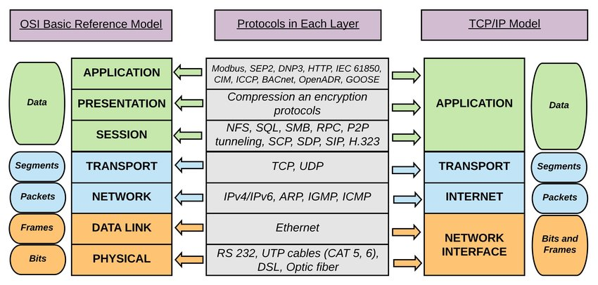

## Network Models Block Diagram

## Ethernet Interface Block Diagram

## RJ45 Interface
RJ45 is the physical interface for connecting ethernet cable

## Network Interface

In the TCP/IP Modal (_relevant for this course_) Physical and Data Link layer are combined to form the Network Interface.

Network Interface consists of following: 

1. PHY - Physical Layer
2. Data Link Layer, which further consists of 
   1. MAC - Media Access Control sublayer
   2. logical link control (LLC) sublayer 

### PHY - Physical Layer
- Physical layer or layer 1 is the first and lowest layer
- Consists of the electronic circuit transmission technologies
- PHY Layer interfaces with medium access control (MAC) sublayer

### MAC Layer (Medium access control)
- MAC sublayer controls the hardware responsible for interaction with the wired, optical or wireless transmission medium.

### Logical link control (LLC)
- Logical link control (LLC) `data communication protocol layer` is the upper sublayer of the data link layer.
- LLC provides flow control and multiplexing for the logical link (i.e. EtherType, 802.1Q VLAN tag etc)

> Logical link control sublayer along with controls for MAC and PHY and data transmisson ans reception are implementd as part of ethernet deriver.  

## Software running on MCU/CPU/FPGA/ASIC
- Software running on MCU/CPU/FPGA/ASIC implements the ethernet driver
- It transmits and receives the ethernet frames
- It controls the MAC sublayer (hardware)
- It controls the PHY sublayer (hardware)
- Collects MAC and PHY stats and status