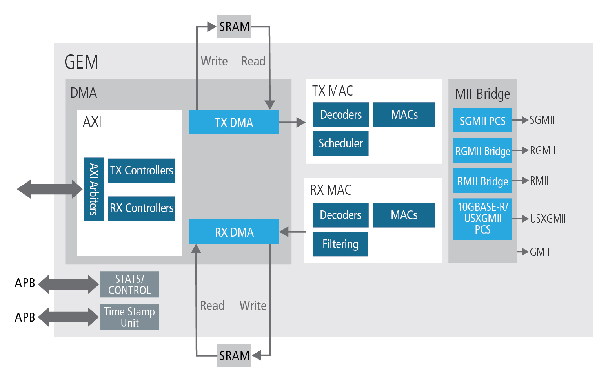
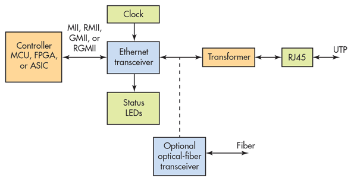

## Ethernet Interface Block Diagram

## Ethernet MAC Block Diagram

## MAC Controller aka Ethernet Controller

An `Ethernet controller` or `Ethernet Media Access Controller` is hardware responsible for interaction with the wired, optical or wireless transmission medium. Transmission medium is implemented by the PHY Device.

MAC controller is majorly implemented in Hardware.

> In Software The MAC sublayer and the logical link control (LLC) sublayer together make up the data link layer.

### Functions of Ethernet MAC
- Receive/transmit normal frames
- half-duplex retransmission and backoff functions
- append/check FCS
- interframe gap enforcement
- discard malformed frames
- prepend(tx)/remove(rx) preamble
- SFD (start frame delimiter), and padding
- half-duplex compatibility: append(tx)/remove(rx) MAC address

## Ethernet PHY

- Physical layer or layer 1 is the first and lowest layer
- Implemented as Phy Device (Hardware)
- Also called `transreceiver device`
- Can also connect to optionally to optical fibre transreceiver
- Generally needs external clock input for its functioning
- Status LEDs over GPIOs
- Implements MII, RMII, GMII, RGMII interfaces towards MAC Controller
- Defines the means of transmitting raw bits over medium

### Major Functions of PHY Layer
- Autonegotiation
  - Bit Rate
  - Duplex Mode
- Bitstream Tx/Rx from MAC
- Modulation
- FEC - Forward error correction
- Carrier sense and collision detection
- Bit-by-bit or symbol-by-symbol delivery over PHY Medium
- Standardized interface to a physical transmission medium
- Specification for connectors and cables
- Electrical specification of transmission line signal level and impedance
- Bit synchronization in synchronous serial communication
- Start-stop signalling and flow control in asynchronous serial communication
- Circuit switching
- Multiplexing
- Equalization filtering, training sequences, pulse shaping and other signal processing of physical signals

### Ethernet physical layer Include
- 10BASE-T 
- 10BASE2 
- 10BASE5 
- 100BASE-TX 
- 100BASE-FX 
- 100BASE-T 
- 1000BASE-T 
- 1000BASE-SX

## Ethernet Driver

Ethernet drivers is a software programs that provide hardware-software interaction between the operating system and its local area network (LAN) port

### Ethernet Driver Functions
- It transmits and receives the ethernet frames
- Impements Ring Buffers
  - Tx Ring Buffers
  - Rx Ring Buffers
- Controls the DMA Operation between MAC and Ring Buffers
- Receives Rx Pacakets from Rx Ring Buffers.
- Delivers Rx packets to higher layer (Linux Bridge)
- Receives Tx packets from higher layer (Linux Bridge)
- Delivers Tx packets to Tx Ring Buffers
- It controls the MAC sublayer (hardware) over IO Interface
- It controls the PHY sublayer (hardware) Over MDIO Interface
- Collects MAC and PHY stats and status
- Exposes MAC and PHY stats and status to the application

## Media Independent Interface

